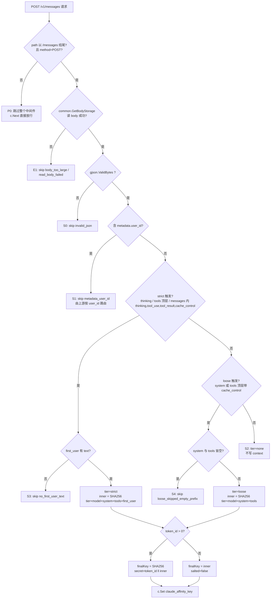

# 亲和性计算规则穷举(实现现状)

本文档完整列出**每一种**会让中间件写入 / 跳过 `claude_affinity_key` 的请求模式,以及对应的 hash 输入字段。代码在 `middleware/claude_affinity.go`,本文档是 hash 行为的**单一权威**。

## 决策流程图



## 跳过场景(不写 `claude_affinity_key`)

| # | 场景 | 触发条件 | `reason` | 中间件行为 | 请求最终走向 |
|---|------|---------|---------|---------|---------|
| **P0** | 路径不匹配 | `method != POST` 或 `path` 不以 `/messages` 结尾 | (DEBUG 日志 `not_messages_endpoint`) | 1 行比较后 `c.Next()` | 走 Distribute 原有策略 |
| **E1a** | body 过大 | `common.GetBodyStorage` 返回 `ErrRequestBodyTooLarge`(超过 `constant.MaxRequestBodyMB`,默认 128MB) | (WARN 日志 `get_body_storage_failed`) | `c.Next()` 透传 | 走 Distribute 原有策略 |
| **E1b** | body 读取失败 | `storage.Bytes()` 返回错误 | (WARN 日志 `read_body_failed`) | `c.Next()` 透传 | 走 Distribute 原有策略 |
| **E2** | panic | `Inspect` / gjson 解析意外 panic | (ERROR 日志 `panic recovered`) | `defer recover()` 捕获 + `c.Next()` | 走 Distribute 原有策略 |
| **S0** | 非法 JSON | body 不是合法 JSON | `invalid_json` | `c.Next()` 透传 | 上游会自己返回 4xx |
| **S1** | 客户端已带用户标识 | `metadata.user_id` 字段存在(包括空字符串) | `metadata_user_id` | `c.Next()`,亲和决策交给上游 | 上游按 user_id 自行做亲和路由 |
| **S2** | 普通 chat | 无任何 strict / loose 触发 | (日志 `tier="" triggers=[]`) | `c.Next()` | Distribute 走原有权重 / 优先级策略 |
| **S3** | strict 触发但首条 user 无 text | strict 触发命中,但 `messages` 中第一条 `role=user` 没有任何 `type=text` 块(例如 image-only) | `no_first_user_text` | `c.Next()` | 走原有权重路由 |
| **S4** | loose 触发但前缀全空 | 仅有 `system` / `tools` 上的 `cache_control`,但规范化后的 `system` 和 `tools` 都是空字符串 | `loose_skipped_empty_prefix` | `c.Next()` | 走原有权重路由 |

## 命中场景(写入 `claude_affinity_key`)

每种触发都会通过 `tier` 字段决定 inner hash 公式,**strict 永远优先于 loose**。inner hash 计算完后,如果 `token_id > 0` 还会经过一层 salt(见末尾"Salt 二次 hash 层")。

### Strict tier - `inner = SHA256(tier + model + system + tools + first_user)`

| # | 触发条件(任一即命中 strict) | inner hash 字段 | 跨渠道后果 |
|---|------|------|------|
| **A1** | 顶层 `thinking.type` 存在且 ≠ `"disabled"` | tier, model, system, tools, first_user | **400** `Invalid signature in thinking block`(下一轮就会有 signature) |
| **A2** | 顶层 `tools[]` 非空(即 `tools.0` 存在) | 同上 | **400** `unexpected tool_use_id`(下一轮就会有 tool_use) |
| **A3** | `messages[*].content[*].type` 出现 `thinking` 或 `redacted_thinking` | 同上 | **400** `Invalid signature in thinking block` |
| **A4** | `messages[*].content[*].type` 出现 `tool_use` / `tool_result` / `server_tool_use` | 同上 | **400** `unexpected tool_use_id` |
| **A5** | `messages[*].content[*].cache_control` 存在 | 同上 | 仅 cache miss;走 strict 是为了同会话多轮稳定路由 + 多用户分散负载 |
| **A6** | `tools[*].cache_control` 存在 | 同上(被 A2 一并触发,整体 strict) | 同 A2 |

### Loose tier - `inner = SHA256(tier + model + system + tools)`

| # | 触发条件(无任何 strict 触发时才生效) | inner hash 字段 | 跨渠道后果 |
|---|------|------|------|
| **B1** | `system[*].cache_control` 存在 | tier, model, system, tools(**不含 first_user**) | 仅 cache miss;多用户共享同一 `system + tools` 会塌缩到同一渠道复用 cache |
| **B2** | `tools[*].cache_control` 存在但 `tools[]` 为空(理论上不可能;列出仅为完整性) | - | 实际不会发生 |

> **注意**:B2 在工程上不会出现 - 在 tool 上挂 `cache_control` 必然意味着 `tools[]` 非空,会被 A2 抢先触发为 strict。所以 **loose 实际上只能由 B1 单独触发**。

### 多触发并存的优先级

| 同时存在的特征 | 最终 tier | inner hash 字段 |
|------|------|------|
| A1 + B1(thinking + system cache) | strict | tier, model, system, tools, first_user |
| A2 + B1(tools[] + system cache) | strict | 同上 |
| A4 + B1(messages tool_use + system cache) | strict | 同上 |
| A5 + B1(messages cache_control + system cache) | strict | 同上 |
| A1..A6 任意 + B1 | strict | 同上 |
| 仅 B1 | loose | tier, model, system, tools |

**规则**:strict 一旦命中,后续所有 loose 触发都被吸收成 strict。

## inner hash 字段的精确取值规则

| 字段 | 取值规则 | 备注 |
|------|------|------|
| `tier` | 字符串 `"strict"` 或 `"loose"` | 显式带入 hash 防止两档碰撞(例如 strict 但 first_user 为空时仍与 loose 不同) |
| `model` | `body.model` 原样字符串 | 不做大小写 / 别名规范化 |
| `system` | 字符串形式:直接取值<br>数组形式:所有 `type=text` 块的 `text` 用 `\n` 拼接 | `cache_control` 字段被剥掉,**加/移除 cache_control 不改 hash** |
| `tools` | 每个 tool 取 `(name, description, input_schema.Raw)` 三元组,按 `name` 升序排序后拼接 | 工具次序改变不影响 hash;`cache_control` 被剥掉 |
| `first_user` | `messages` 中**第一条** `role=user` 消息的 `content`:字符串直接用;数组只拼接所有 `type=text` 块的 `text` | image / tool_result 等非文本块被忽略;空文本将走 S3 跳过 |

字段之间用不可打印分隔符拼接:

```
key1 \x00 value1 \x01 key2 \x00 value2 \x01 ...
```

`tools` 内部三元组用 `\x1f` 分隔字段,`\x1e` 结尾。

最后做一次 SHA256 → hex(64 字符)= **inner hash**。

## Salt 二次 hash 层

inner hash 仅与 body 内容相关。中间件在写入 context 前还会做一次"用户隔离"层:

```go
finalKey =
  if token_id > 0:
    SHA256("secret" ‖ \x00 ‖ strconv.Itoa(token_id) ‖ \x01 ‖
           "inner"  ‖ \x00 ‖ innerKey            ‖ \x01)
  else:  // 降级路径
    innerKey
```

| 条件 | finalKey 计算方式 | 日志 `salted` 字段 |
|------|------|------|
| `token_id > 0`(正常情况,TokenAuth 已写入 Context) | `SHA256(secret=token_id ‖ inner=innerKey)` | `true` |
| `token_id == 0`(理论上 TokenAuth 不会放过去) | inner hash 直接作为 finalKey | `false` |

**为什么是 `token_id` 而不是其他字段**:

- `token_key`(sk-xxx 明文):泄漏风险高,`token_id` int 不会泄漏 API key 字面值
- `user_id`:同一用户多个 token 会塌到一组渠道,失去 token 级隔离
- `IP` / `User-Agent`:不稳定,用户切换网络就丢失亲和

**为什么是二次 hash 而不是一次 hash 输入**:

- `Inspect()` / `computeKey()` 是从专用反代项目 `claude-affinity-proxy` 整段照搬的纯函数,行为是 hash 的权威实现,**禁止修改其字段**(详见 [CLAUDE.md](CLAUDE.md) 金线 3)
- 在中间件层做二次 hash 完全等价(都是 SHA256 hex),且不污染原始 hash 行为,跨版本可演进

## "命中场景 ↔ hash 字段"的最终速查表

将上述所有命中模式(去掉跳过场景)压成一张快速对照表。**finalKey 一律是"对应 inner hash 经 token_id salt 后的 SHA256 hex"**:

| 命中模式 | tier | 进入 inner hash 的字段 | salt 后 finalKey 写入 |
|------|------|------|------|
| 顶层 `thinking` 启用 | strict | `tier, model, system, tools, first_user` | `claude_affinity_key` |
| 顶层 `tools[]` 非空 | strict | `tier, model, system, tools, first_user` | `claude_affinity_key` |
| `messages` 内有 `thinking` / `redacted_thinking` 块 | strict | `tier, model, system, tools, first_user` | `claude_affinity_key` |
| `messages` 内有 `tool_use` / `tool_result` / `server_tool_use` 块 | strict | `tier, model, system, tools, first_user` | `claude_affinity_key` |
| `messages` 内任意 content 块带 `cache_control` | strict | `tier, model, system, tools, first_user` | `claude_affinity_key` |
| `tools` 数组某个 tool 带 `cache_control`(必然触发 A2) | strict | `tier, model, system, tools, first_user` | `claude_affinity_key` |
| 上述 strict 触发的任何组合 | strict | `tier, model, system, tools, first_user` | `claude_affinity_key` |
| 仅 `system` 块带 `cache_control`(且无任何 strict 触发) | loose | `tier, model, system, tools` | `claude_affinity_key` |

## 不进入 hash 的字段(明确清单,避免误解)

为了让"同一会话每轮 hash 完全相同",下列字段一律**忽略**:

- `messages` 中除"第一条 user 消息"以外的全部内容(assistant 回复、后续 user 消息、tool_use、tool_result、thinking 块)
- 任何位置的 `cache_control` 字段本身(仅作为触发标识,不进 inner hash)
- `thinking.budget_tokens`、`max_tokens`、`temperature`、`top_p`、`top_k` 等推理参数
- `tool_choice`、`stream`、`stop_sequences` 等控制字段
- `metadata.*`(`user_id` 用于 S1 跳过判断,其余字段全部忽略)
- `anthropic-beta` / `anthropic-version` 等 HTTP header
- 客户端 IP、User-Agent、其他请求头
- `model_alias` 等 new-api 的 model_mapping 后的目标模型(中间件取的是 body 原始 `model` 字段,在 model_mapping 之前)
- JSON 字段顺序、空格、换行(gjson 按字段名取值,不依赖原始字节)

## 与决策流程的对应日志样例

启用文件日志后(`new-api --log-dir <path>`),典型输出如下:

```text
# P0 路径过滤(DEBUG,生产环境通常关闭)
[DEBUG] 2026/04/30 - 14:24:03 | mno-345-req-id | [claude_affinity] skip path=/v1/chat/completions method=POST reason=not_messages_endpoint

# E1a body 过大
[WARN]  2026/04/30 - 14:25:30 | stu-901-req-id | [claude_affinity] get_body_storage_failed path=/v1/messages content_length=156237824 err=request body exceeds 128 MB

# S1 metadata.user_id 短路(DEBUG)
[DEBUG] 2026/04/30 - 14:24:01 | jkl-012-req-id | [claude_affinity] miss reason=metadata_user_id model=claude-opus-4-6 body_bytes=1203 elapsed=6.2µs

# S2 普通 chat(DEBUG)
[DEBUG] 2026/04/30 - 14:24:05 | pqr-678-req-id | [claude_affinity] miss reason=no_trigger_matched model=claude-opus-4-6 body_bytes=815 elapsed=5.1µs

# A1/A3 strict 命中(thinking)
[INFO]  2026/04/30 - 14:23:12 | abc-123-req-id | [claude_affinity] hit tier=strict triggers=[thinking] key=4a8f9c1d2e3b6071 salted=true token_id=42 model=claude-opus-4-6 body_bytes=4827 elapsed=14.2µs

# A2 strict 命中(tools 顶层)
[INFO]  2026/04/30 - 14:23:15 | def-456-req-id | [claude_affinity] hit tier=strict triggers=[tool] key=7d2e891f0a4c5b63 salted=true token_id=42 model=claude-opus-4-6 body_bytes=5102 elapsed=11.8µs

# B1 loose 命中(system cache)
[INFO]  2026/04/30 - 14:23:18 | ghi-789-req-id | [claude_affinity] hit tier=loose triggers=[cache] key=9c1f482e7a0d3b65 salted=true token_id=42 model=claude-opus-4-6 body_bytes=2841 elapsed=8.7µs

# E2 panic 恢复
[ERR]   2026/04/30 - 14:26:11 | vwx-234-req-id | [claude_affinity] panic recovered path=/v1/messages panic=runtime error: index out of range
```

## 关键不变量(改动审计 checklist)

任何修改 hash 行为的 PR 都必须保证以下不变量,否则会让线上正在跑的会话 hash 漂移并重新触发本中间件本要解决的 400 错误:

1. **同一会话多轮 hash 完全相同** - inner hash 输入只用"会话期间永不变的前缀"(model + system + tools + first_user),严禁依赖 messages 中第一条 user 之后的内容
2. **加/移除 cache_control 不改 hash** - cache_control 仅作为触发标识,不进 inner hash 字段
3. **tools 数组次序不影响 hash** - 必须按 name 排序
4. **tier 标签防碰撞** - strict 与 loose 的 hash 输入永远不会撞(即使 first_user 为空)
5. **messages 内 cache_control 必须判 strict** - 改回 loose 会触发"全部流量塌到一个渠道"的灾难性 bug
6. **B1 防退化保护** - system 与 tools 都为空时 loose 必须跳过(S4),否则 hash 退化为 (tier+model) 近常量
7. **S1 短路必须最优先** - metadata.user_id 存在时,无论是否触发 strict/loose 都应跳过(把亲和决策权交给上游)
8. **token_id salt 必须使用 int 类型来源** - 不能换成 token_key 字符串
9. **finalKey 必须是 64 字符 hex** - 不能改成 base64 / fnv32 / 其他哈希算法,因为 new-api 的 Distribute 用一致性哈希按字符串落桶,长度变化会破坏分布

## 改动审计

任何修改 hash 行为的 PR 都必须:

1. 同步更新本文档对应的表格行
2. 同步更新 [CLAUDE.md](CLAUDE.md) 改动金线相关章节
3. 在 `middleware/claude_affinity_test.go` 增加回归测试(单测文件可以新增/扩展)
4. 通过 `go build ./middleware/... ./router/...` 与 `go vet ./middleware/... ./router/...`
5. 评估对线上已有会话的兼容性 - 如果是不向后兼容的改动,必须有灰度 + 双 key 过渡方案

> **重要**:如果改动需要触及 `middleware/claude_affinity.go` 与 `router/relay-router.go` 之外的任何文件(包括 `constant/`、`common/`、其他 middleware、controller、setting),必须先与维护者明确确认 3 次以上才能扩散。详见 [CLAUDE.md](CLAUDE.md) 改动金线 2。
