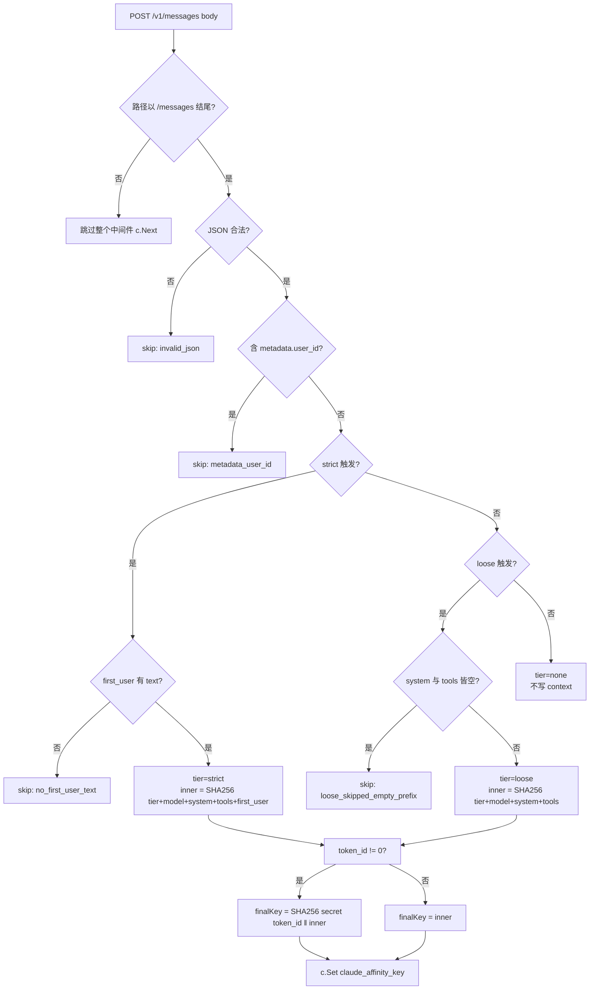

# CLAUDE.md

> 面向 AI 助手(Claude Code / Cursor / Codex 等)的项目上下文。阅读完本文应能立即在 new-api 项目中正确改动这个中间件。

## 项目定位

**Claude 渠道亲和性中间件**(`middleware/claude_affinity.go`)是 new-api 的一个 gin 中间件。它**唯一的职责**是为 new-api 在多渠道场景下解析 Claude `/v1/messages` 请求 body,识别该请求是否需要"被路由到与上一轮相同的上游渠道",命中则把一个稳定的 SHA256 hex 写入 gin Context 的 `claude_affinity_key`。后续 `middleware.Distribute` 通过 `context_string` 类型的渠道亲和性规则读取此 key,完成一致性哈希落桶。

中间件**完全无状态**,无外部依赖(Redis / DB / 任何缓存),可水平扩展。

## 核心问题(必读)

Claude 官方 API 对会话内容有严格的**服务端一致性**要求。new-api 默认按权重/随机分发渠道,会破坏这个一致性:

| 特性 | 跨渠道后果 |
|------|------|
| `thinking.signature` | **400** `Invalid signature in thinking block`(签名按 provider 加密) |
| `tool_use.id` ↔ `tool_result.tool_use_id` | **400** `unexpected tool_use_id` |
| `cache_control` | 缓存按 organization 隔离,跨渠道仅 cache miss 不报错 |

中间件的存在就是阻止"同一会话被打到不同渠道"。

## 仓库结构

整个改造的代码侵入面**只有两个文件**:

```
new-api/
├── middleware/claude_affinity.go     # 本中间件唯一的源码文件
└── router/relay-router.go            # 仅一行 httpRouter.Use(middleware.ClaudeAffinityHash())
```

文档目录:

```
docs/claude-affinity-proxy/
├── README.md      # 使用者视角(接入方式 + 强约束)
├── CLAUDE.md      # 本文件(AI 助手视角)
├── AFFINITY.md    # 触发条件与 hash 字段穷举规约
└── TESTING.md     # REST API 测试用例集(覆盖所有决策分支)
```

## 关键设计速查

### 1. 双档亲和(strict / loose / none)



| tier | 触发条件 | inner hash 输入 | 是否含 first_user |
|------|------|------|------|
| **strict** | 顶层 thinking 启用 / 顶层 tools[] / messages 内 thinking·tool_use·tool_result·**cache_control** | tier+model+system+tools+first_user | 是 |
| **loose** | 仅 `system[*].cache_control`(且无任何 strict 触发) | tier+model+system+tools | 否 |
| **none** | 无触发 / metadata.user_id / first_user 无文本 / loose 但前缀全空 | (不计算) | (不写 context) |

> **严禁**改回"messages 内 cache_control 走 loose"—— 会触发"全部流量塌到一个渠道"的灾难性 bug。详见 [AFFINITY.md](AFFINITY.md)。

完整规则见 [AFFINITY.md](AFFINITY.md),是 hash 行为的**单一权威**。

### 2. token_id salt(用户隔离层)

inner hash 仅与 body 内容相关。中间件读取 `TokenAuth` 已写入 Context 的 `token_id`(int 类型),做一次外层 SHA256:

```go
finalKey = SHA256("secret" ‖ \x00 ‖ strconv.Itoa(token_id) ‖ \x01 ‖ "inner" ‖ \x00 ‖ innerKey ‖ \x01)
```

效果:
- 同 token 多轮请求 → finalKey 相同 → 落同一渠道(会话亲和)
- 不同 token 相同 body → finalKey 不同 → 路由分散(token 隔离)
- token_id 为 0 时(理论上 TokenAuth 不会放过去)降级为不加 salt,日志 `salted=false`

### 3. 路径过滤

中间件挂在 `httpRouter` group 上,而该 group 同时包含 `/v1/chat/completions` / `/v1/responses` / `/v1/embeddings` 等多种路由。中间件内部用 `strings.HasSuffix(c.Request.URL.Path, "/messages")` 过滤,非匹配请求 1 行比较后立即 `c.Next()`,不读 body 不算 hash。

### 4. 永不阻断进行中的请求

中间件遇到任何错误都**透传**:

| 错误 | 行为 |
|------|------|
| body 过大 (`common.ErrRequestBodyTooLarge`) | 日志 WARN,c.Next() |
| body 读取失败 | 日志 WARN,c.Next() |
| JSON 非法 (`gjson.ValidBytes` 返回 false) | Inspect 返回 `Reason=invalid_json`,c.Next() |
| metadata.user_id 短路 | Inspect 返回 `Reason=metadata_user_id`,c.Next() |
| panic | `defer recover()` 捕获,日志 ERROR,c.Next() |

绝不调用 `c.Abort()`,绝不返回 4xx/5xx。

### 5. body 字节零修改

只通过 `common.GetBodyStorage(c)` 读字节(内部缓存到 `c[KeyBodyStorage]`,下游 `UnmarshalBodyReusable` 自动复用);**绝不**修改 body、**绝不**替换 `c.Request.Body`。

### 6. 日志走 new-api 现有体系

```go
import "github.com/QuantumNous/new-api/logger"

logger.LogInfo(ctx, ...)   // 命中
logger.LogDebug(ctx, ...)  // 未命中、路径过滤、要 common.DebugEnabled=true 才输出
logger.LogWarn(ctx, ...)   // body 错误
logger.LogError(ctx, ...)  // panic
```

`logger.SetupLogger()` 已在主进程启动时把 `gin.DefaultWriter/DefaultErrorWriter` 替换为 `MultiWriter(stdout/stderr, <LogDir>/oneapi-<ts>.log)`,所以中间件**零额外配置自动落盘**。

`ctx` 从 `c.Request.Context()` 取,日志自带 request id(由 new-api 的请求 ID 中间件写入 `common.RequestIdKey`),便于把"亲和键命中"和"实际选中渠道"在日志里串联。

## 配置(全部硬编码)

中间件**不暴露任何外部配置**(无 YAML、无环境变量、无系统设置面板),全部参数以本地常量形式硬编码在 `middleware/claude_affinity.go` 文件顶部:

| 常量/变量 | 值 | 含义 |
|------|------|------|
| `claudeAffinityContextKey` | `"claude_affinity_key"` | 写入 gin Context 的 key 名;后台规则的 Key 字段必须填同样字符串 |
| `claudeMessagesPathSuffix` | `"/messages"` | 路径过滤后缀 |
| `claudeAffinityLogPrefix` | `"[claude_affinity]"` | 日志前缀,便于运维 grep |
| `claudeAffinityKeyLogLen` | `16` | 日志中亲和键打印的最大字符数(完整 SHA256 hex 是 64) |
| `tokenIdContextKey` | `"token_id"` | secret 来源,对齐 `TokenAuth` 的 `c.Set("token_id", token.Id)` |
| `defaultClaudeAffinityTrigger.OnThinking/OnTool/OnCache` | 全 `true` | 三个触发器开关 |

修改任何配置请直接改源码常量,**不要**在中间件中读 YAML / 环境变量 / 数据库。

## 改动金线(强约束,必读)

> 任何改动必须遵守以下约束。违反会破坏中间件的"最小侵入"原则或导致线上故障。

### 金线 1:不引入任何当前项目尚未使用的依赖

**当前允许的依赖**:

- 标准库:`crypto/sha256`、`encoding/hex`、`fmt`、`net/http`、`sort`、`strconv`、`strings`、`time`
- new-api 本项目包:`github.com/QuantumNous/new-api/common`、`github.com/QuantumNous/new-api/logger`
- new-api 已有间接依赖:`github.com/tidwall/gjson`(已被 `service/channel_affinity.go` 等多处使用)
- 框架:`github.com/gin-gonic/gin`

**禁止**引入 `lumberjack`、`zap`、`logrus`、`slog`、`xxhash`、`fnv`、`murmur3`、`viper`、任何 RPC/HTTP 客户端库,**任何当前 new-api 主项目尚未使用的库**。如果对某个库是否"已使用"有疑问,先 `grep` 整个项目的 `go.sum` 和 `import` 块确认,**禁止凭印象判断**。

### 金线 2:不增加任何其他文件的改动

**整个改造的代码侵入面只允许两个位置**:

1. 新增/修改 `middleware/claude_affinity.go`(中间件本体)
2. 修改 `router/relay-router.go` 第 84-85 行附近的注册行(且仅这一行)

**禁止**:
- 在 `constant/` 加新常量(用本地常量代替)
- 在 `common/` 加工具函数(用本地辅助函数代替,例如 `saltAffinityKey`)
- 修改 `middleware/` 下任何其他文件
- 修改 `service/`、`controller/`、`router/` 下除上述一行之外的任何代码
- 修改 `setting/`、UI、数据库迁移
- 添加新的测试文件之外的副作用文件(如 README、CHANGELOG)

如果实在需要扩展(例如要从数据库读 token 维度的开关配置),**必须先与维护者确认 3 次以上**才能扩散到其他文件。

### 金线 3:hash 计算逻辑不可修改

**受保护函数**(在 `middleware/claude_affinity.go` 末尾"以下是从 affinity.go 整段照搬的纯函数"分隔符之下):

- `Inspect`
- `hasCacheControl`
- `normalizedSystem`
- `canonicalTools`
- `firstUserText`
- `computeKey`
- `writeKV`

**绝对禁止**:
- 修改任一函数的字段提取逻辑(会让线上会话 hash 漂移 → 跨轮重路由 → 重新触发 400)
- 让 hash 输入字段依赖 `messages` 中第一条 user 之后的内容(破坏多轮稳定性)
- 把 `messages` 内 `cache_control` 改回 loose tier(会触发"全部流量塌到一个渠道"的灾难性 bug)
- 修改字段分隔符 `\x00` / `\x01` / `\x1e` / `\x1f`
- 修改 hash 算法(必须保持 SHA256 → hex)

如果必须改(例如新增触发类型或 Anthropic 协议变更),改动前必须:
1. 同步更新 [AFFINITY.md](AFFINITY.md) 对应表格
2. 增加单元测试覆盖新行为(单元测试文件可以增加,不算"其他文件改动")
3. 评估对线上已有会话的兼容性(通常需要灰度 + 双 key 过渡)

### 金线 4:saltAffinityKey 的 secret 必须是 token_id

不要换成:
- `token_key`(sk-xxx 明文,日志泄漏风险)
- `user_id`(同一用户多个 token 会塌到一组渠道,失去 token 级隔离)
- IP / User-Agent(不稳定,用户切网络就丢亲和)

`token_id` 是 int 类型的数据库主键,稳定、唯一、零信息泄漏。

### 金线 5:中间件必须在 Distribute 之前注册

`Distribute` 是渠道选择中间件,会读 `claude_affinity_key`。本中间件必须先于 Distribute 执行,否则 Distribute 读到空 → 退化随机选择 → 整个改造失效。

注册位置:`router/relay-router.go` 中 `httpRouter := relayV1Router.Group("")` 之后、`httpRouter.Use(middleware.Distribute())` **之前**那一行。

### 金线 6:任何错误都必须透传

中间件设计原则是"永不阻断业务请求"。无论是 body 过大、JSON 非法、panic、还是 token_id 拿不到,都必须 `c.Next()` 让请求走原本流程。**绝不**调用 `c.Abort()` 或返回 4xx/5xx。

### 金线 7:body 字节零修改

只通过 `common.GetBodyStorage(c)` 读字节;**绝不**:
- 修改 body
- 替换 `c.Request.Body`(下游 `UnmarshalBodyReusable` 已经处理回填)
- 调用 `io.ReadAll(c.Request.Body)`(会消耗 Reader,破坏下游)

### 金线 8:日志必须走 logger 包

不允许:
- `fmt.Println` / `fmt.Printf`(直接到 stdout,跳过文件落地)
- `log.Println`(同上)
- 引入 `lumberjack` / `zap` / `logrus`

只能用 `logger.LogInfo/LogWarn/LogError/LogDebug`,这些函数自动带 request id,自动写到 `gin.DefaultWriter/DefaultErrorWriter`(已被 `SetupLogger()` 替换为 `MultiWriter(stdout, file)`)。

## 如何验证改动

```bash
# 编译
go build ./middleware/... ./router/...

# 静态检查
go vet ./middleware/... ./router/...

# 全量编译(确认没破坏其他模块)
go build ./...

# 运行时验证(启动 new-api 后)
grep '\[claude_affinity\]' <log-dir>/oneapi-*.log
```

如果你修改了 hash 逻辑,**必须**新写或更新单元测试,可以放在 `middleware/claude_affinity_test.go`(同目录单测文件不算"其他文件改动")。

## 当前已知约定与依赖事实

- 依赖 `TokenAuth` 中间件先于本中间件执行,且会写入 `c.Set("token_id", token.Id)`(对应 `middleware/auth.go` 中的现有逻辑)
- 依赖 `Distribute` 中间件晚于本中间件执行,且会通过 `context_string` 来源读取 `claude_affinity_key`
- 依赖 `common.GetBodyStorage(c)` 会缓存 BodyStorage 到 `c[KeyBodyStorage]`,且下游 `common.UnmarshalBodyReusable` 会复用
- 依赖 `logger.SetupLogger()` 已把 `gin.DefaultWriter` 替换为 `MultiWriter(stdout, file)`
- 依赖请求 ID 中间件已经写入 `common.RequestIdKey` 到 `c.Request.Context()`

如果上述任何依赖事实因 new-api 主项目演进而失效,**优先调整本中间件去适配新的事实**,而不是修改主项目源码。

## 常见误区

- **Q: 为什么不把整个 messages 都做 hash?**
  A: 多轮 messages 每次都在变,整体 hash 不稳定 → 每轮换渠道 → 立刻 400。只取**会话期间永不变的前缀**:`model + system + tools + first_user`。

- **Q: 为什么 messages 内 cache_control 是 strict 而不是 loose?**
  A: messages 内容必然不同,跨用户根本不可能复用 cache。它真正能用上的场景只有"同一会话多轮的增量缓存",这本身就是 strict 的语义。如果错误判 loose,system/tools 都为空时 hash 退化为常量,所有此类请求挤到同一个渠道。

- **Q: 客户端断开会怎样?**
  A: gin 的 `http.Server` 会取消请求 ctx,Distribute 选中的上游连接会被关闭。这是"客户端中断",不是"中间件中断",符合金线 6。

- **Q: 如何接 Claude Code CLI?**
  A: Claude Code CLI 自动发 `metadata.user_id`,`Inspect` 会**短路**(skip_reason=metadata_user_id),不写 context key,亲和决策权交给上游 —— 上游自己按 user_id 做亲和即可。本中间件对 Claude Code 用户**完全无副作用**。

- **Q: token_id 是从哪个 context key 拿的,会不会拿不到?**
  A: 从 gin Context 的字符串 key `"token_id"`(`c.GetInt("token_id")`),由 `TokenAuth` 中间件写入(对应 `c.Set("token_id", token.Id)`)。如果 TokenAuth 没放过去(例如认证失败),请求根本不会走到本中间件。极端情况下若 token_id 为 0,中间件降级为不加 salt,日志 `salted=false`,功能不会失效。
